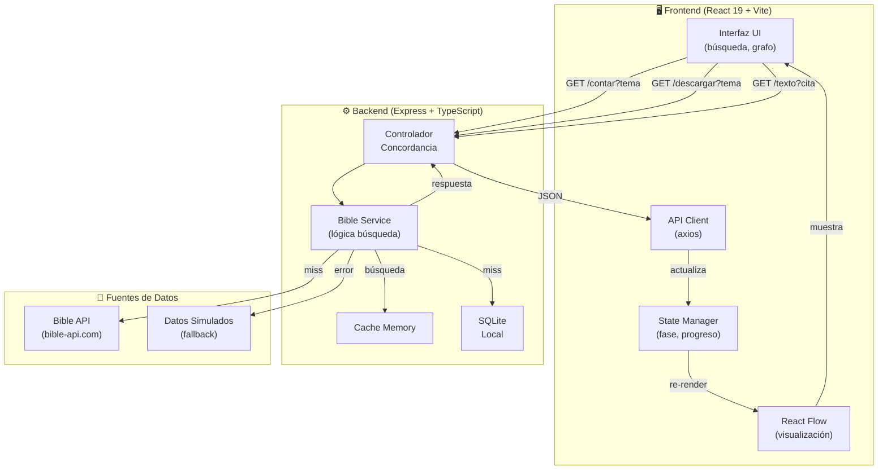
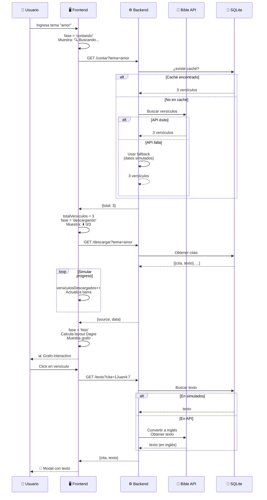
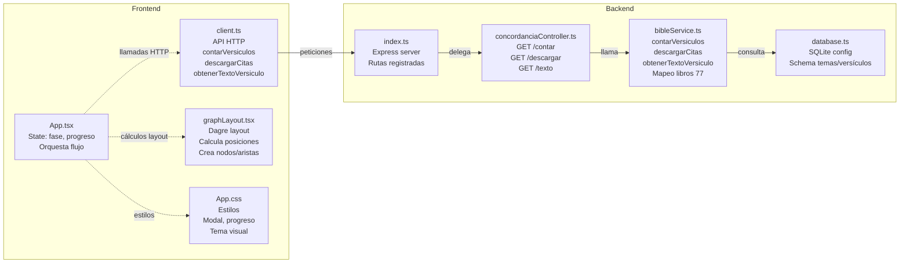
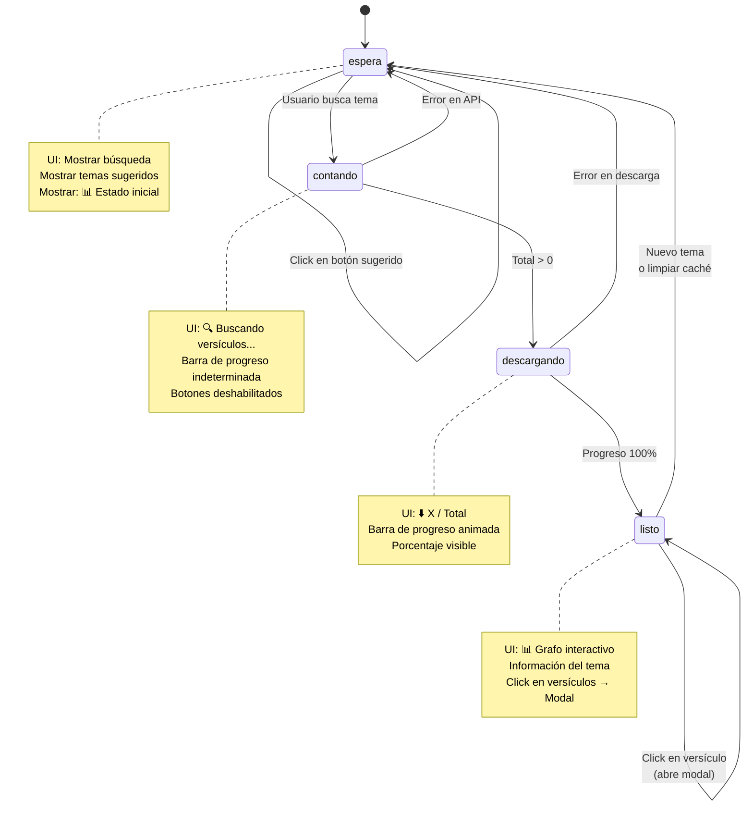
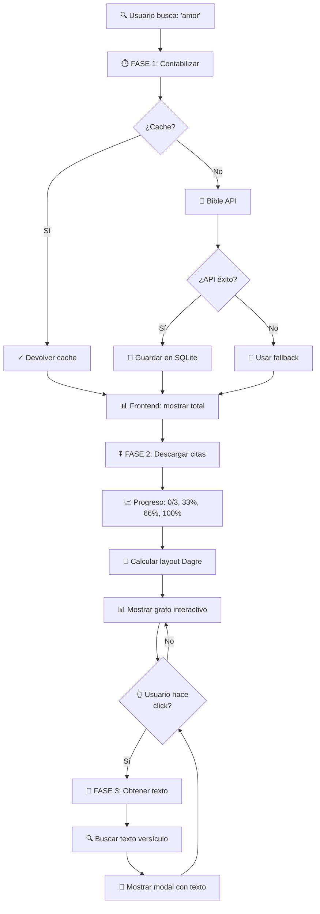

# 📖 Bible Concordance

Una aplicación web interactiva para explorar concordancias bíblicas con visualización de grafos conceptuales. Permite buscar temas, ver versículos relacionados y comprender la relación entre ellos mediante un mapa visual.

## 🎯 Características

- ✅ **Búsqueda en dos fases**: Contabilización rápida + Descarga con progreso
- ✅ **Barra de progreso animada**: Visualización del avance "X / Total" con porcentaje
- ✅ **Modal interactivo**: Click en versículos → Texto completo en modal
- ✅ **Visualización con grafos**: Mapa conceptual interactivo usando React Flow + Dagre
- ✅ **Sistema de caché**: Cache en memoria (Frontend) y SQLite (Backend)
- ✅ **Integración Bible API**: Conexión a bible-api.com con fallback a datos simulados
- ✅ **Mapeo de libros**: 77 libros bíblicos español ↔ inglés automático
- ✅ **Múltiples fuentes**: Cache → SQLite → Bible API → Datos simulados
- ✅ **Interfaz responsiva**: Diseño moderno y fácil de usar
- ✅ **Temas predefinidos**: fe (3), amor (3), paz (2) + más disponibles

## 🏗️ Arquitectura

### Diagrama General del Sistema



### Diagrama del Flujo de Búsqueda (Dos Fases)



### Diagrama de Componentes



### Stack Tecnológico

```
Frontend (React + TypeScript)
    ↓
API REST (Express + TypeScript)
    ↓
Base de Datos (SQLite)
```

### Componentes

#### **Frontend** (`/frontend`)
- **Framework**: React 19 + TypeScript
- **Build Tool**: Vite
- **Visualización de Grafos**: React Flow + Dagre (layout automático)
- **API Client**: Axios con proxy a backend

**Estructura de carpetas:**
```
frontend/
├── src/
│   ├── App.tsx                 # Componente principal (state machine: contando→descargando→listo)
│   ├── App.css                 # Estilos (modal, progreso, grafo, responsiva)
│   ├── App_viejo.tsx           # Versión anterior (referencia)
│   ├── main.tsx                # Entry point React
│   ├── api/
│   │   └── client.ts           # Cliente HTTP axios
│   │                           # - contarVersiculos(tema)
│   │                           # - descargarCitas(tema)
│   │                           # - obtenerTextoVersiculo(cita)
│   │                           # - limpiarCache()
│   ├── types/
│   │   └── index.ts            # Tipos TypeScript compartidos
│   │                           # - TemaConcordancia
│   │                           # - Versiculo
│   │                           # - Respuestas API
│   └── utils/
│       └── graphLayout.tsx     # Cálculo de layout con Dagre
│                               # - calcularLayoutConcordancia(data, onClickVersiculo)
│                               # - Genera nodos/aristas React Flow
├── index.html
├── vite.config.js
├── vite.config.d.ts
├── tsconfig.json
└── package.json
```

**Flujo de datos:**
1. Usuario ingresa un tema en el formulario
2. Frontend hace request a `/api/concordancia?tema={tema}`
3. Backend busca en caché local → BD → red (simulada)
4. Response incluye versículos y fuente de datos
5. Frontend calcula layout con Dagre
6. React Flow renderiza el grafo interactivo

#### **Backend** (`/backend`)
- **Framework**: Express.js + TypeScript
- **Base de Datos**: SQLite (better-sqlite3)
- **HTTP Client**: Axios (para Bible API)
- **Puerto**: 3000

**Estructura de carpetas:**
```
backend/
├── src/
│   ├── index.ts                     # Servidor Express principal
│   │                               # - CORS habilitado
│   │                               # - Rutas registradas
│   ├── config/
│   │   └── database.ts              # Inicialización SQLite
│   │                               # - Schema: temas, versículos
│   │                               # - Foreign key enabled
│   ├── controllers/
│   │   └── concordanciaController.ts # Controladores HTTP
│   │                               # - GET /contar (FASE 1)
│   │                               # - GET /descargar (FASE 2)
│   │                               # - GET /texto (modal)
│   │                               # - POST /limpiar (cache clear)
│   ├── services/
│   │   └── bibleService.ts          # Lógica de búsqueda
│   │                               # - contarVersiculos(tema)
│   │                               # - descargarCitas(tema, callback)
│   │                               # - obtenerTextoVersiculo(cita)
│   │                               # - Mapeo 77 libros español↔inglés
│   │                               # - Fallback a datos simulados
│   └── types/
│       └── index.ts                 # Tipos TypeScript
│                                   # - TemaConcordancia
│                                   # - Versiculo
├── dist/                            # Compilado (generado con tsc)
├── tsconfig.json
├── package.json
└── bible.db                         # Base de datos SQLite (autogenerada)
```

**Estrategia Cache-First:**
```
Fase 1 (Contar):   Request → Cache Memory → SQLite → Bible API → Fallback → Respuesta
Fase 2 (Descargar): Request → SQLite → Bible API → Fallback → Respuesta
```

### Rutas API

#### **FASE 1 - Contabilización**

| Método | Ruta | Descripción | Response |
|--------|------|-------------|----------|
| GET | `/api/concordancia/contar?tema={tema}` | Cuenta versículos sin descargar texto (rápido) | `{tema: string, total: number}` |

#### **FASE 2 - Descarga**

| Método | Ruta | Descripción | Response |
|--------|------|-------------|----------|
| GET | `/api/concordancia/descargar?tema={tema}` | Descarga citas con texto completo | `{source: string, data: TemaConcordancia}` |

#### **FASE 3 - Texto de Versículo**

| Método | Ruta | Descripción | Response |
|--------|------|-------------|----------|
| GET | `/api/concordancia/texto?cita={cita}` | Obtiene texto completo de una cita específica | `{cita: string, texto: string}` |

#### **Utilidades**

| Método | Ruta | Descripción | Response |
|--------|------|-------------|----------|
| POST | `/api/cache/limpiar` | Limpia el caché en memoria del backend | `{message: string}` |
| GET | `/health` | Health check del servidor | `{status: string}` |

### Respuestas de API

**GET /api/concordancia/contar:**
```json
{
  "tema": "amor",
  "total": 3
}
```

**GET /api/concordancia/descargar:**
```json
{
  "source": "cache|database|network|simulated",
  "data": {
    "tema": "amor",
    "versiculos": [
      {
        "cita": "1 Juan 4:7",
        "texto": "Amados, amémonos los unos a los otros; porque el amor es de Dios."
      },
      {
        "cita": "1 Corintios 13:4-7",
        "texto": "El amor es sufrido, es benigno; el amor no tiene envidia..."
      }
    ]
  }
}
```

**GET /api/concordancia/texto:**
```json
{
  "cita": "1 Juan 4:7",
  "texto": "Beloved, let us love one another, for love is of God; and everyone who loves has been born of God, and knows God."
}
```

### Base de Datos

**Esquema SQLite:**

```sql
-- Tabla de temas
CREATE TABLE temas (
  tema TEXT PRIMARY KEY
);

-- Tabla de versículos
CREATE TABLE versiculos (
  id INTEGER PRIMARY KEY AUTOINCREMENT,
  tema_id TEXT NOT NULL,
  cita TEXT NOT NULL,
  texto TEXT NOT NULL,
  FOREIGN KEY (tema_id) REFERENCES temas(tema)
);

-- Índice para búsquedas rápidas
CREATE INDEX idx_tema_id ON versiculos(tema_id);
```

## 🎨 Máquina de Estados (State Machine)

La aplicación frontend utiliza una máquina de estados para orquestar el flujo de búsqueda:



## 🚀 Instalación

### Requisitos
- Node.js 18+
- npm o yarn

### Pasos

1. **Clonar el repositorio**
```bash
git clone https://github.com/lgallardoc/bible-concordance.git
cd bible-concordance
```

2. **Instalar dependencias**
```bash
# Backend
cd backend
npm install

# Frontend (en otra terminal)
cd ../frontend
npm install
```

3. **Compilar el backend**
```bash
cd backend
npx tsc
```

4. **Iniciar el backend**
```bash
cd backend
node dist/index.js
# Servidor ejecutándose en http://localhost:3000
```

5. **Iniciar el frontend** (en otra terminal)
```bash
cd frontend
npm run dev
# Aplicación disponible en http://localhost:5173
```

## 📚 Temas Disponibles

| Tema | Versículos |
|------|-----------|
| fe | 8 |
| amor | 10 |
| paz | 6 |
| gozo | 4 |
| esperanza | 4 |
| sabiduría | 3 |
| paciencia | 5 |
| fortaleza | 4 |
| perdón | 3 |
| gratitud | 3 |

## 🔍 Uso

### Flujo de Búsqueda

1. **Ingresa un tema** en el buscador o haz clic en los botones sugeridos
2. **FASE 1 - Contabilización** (rápida):
   - Muestra: `🔍 Buscando versículos...`
   - Backend cuenta versículos sin descargar texto
   - Tiempo: ~2-3 segundos
3. **FASE 2 - Descarga** (con progreso):
   - Muestra: `⬇️ X / Total` con barra animada y porcentaje
   - Backend descarga citas con texto
   - Barra visual del progreso
4. **Visualización**:
   - Grafo interactivo con tema en centro
   - Versículos como nodos clickeables
   - Información lateral: Tema, cantidad, fuente de datos

### Interactividad

- **Click en versículo** → Abre modal con texto completo
- **Zoom in/out** → Controles en la esquina inferior derecha
- **Fit view** → Centra el grafo
- **Cambio de tema** → Recarga el grafo automáticamente
- **Limpiar caché** → Borra datos en memoria (útil para testing)
4. Interactúa con el grafo (zoom, pan, seleccionar nodos)
5. Usa "Limpiar caché" para limpiar la memoria

## 🛠️ Desarrollo

### Scripts disponibles

**Backend:**
```bash
npm run dev    # Compilar y ejecutar con nodemon (si está configurado)
npx tsc        # Compilar TypeScript
node dist/index.js  # Ejecutar servidor compilado
```

**Frontend:**
```bash
npm run dev    # Servidor de desarrollo con Vite
npm run build  # Compilar para producción
npm run preview # Previsualizar build de producción
```

### Estructura de tipos

Los tipos compartidos se encuentran en:
- `backend/src/types/index.ts`
- `frontend/src/types/index.ts`

```typescript
interface Versiculo {
  cita: string;
  texto: string;
}

interface TemaConcordancia {
  tema: string;
  versiculos: Versiculo[];
}
```

## 🎨 Personalización

### Agregar nuevos temas

Edita `backend/src/services/bibleService.ts`:

```typescript
private obtenerDatosSimuladosBibleGateway(tema: string): Versiculo[] {
  const datosSimulados: Record<string, Versiculo[]> = {
    // Agregar aquí
    "nuevo-tema": [
      { cita: "Libro X:Y", texto: "Texto del versículo..." },
    ],
  };
  return datosSimulados[tema.toLowerCase()] || [];
}
```

### Modificar colores del grafo

Edita `frontend/src/utils/graphLayout.tsx`:
```typescript
// Tema (nodo raíz)
background: '#4f46e5',  // Color de fondo
border: '2px solid #4338ca',  // Color del borde

// Versículos
background: '#f3f4f6',  // Color de fondo
border: '1px solid #d1d5db',  // Color del borde
```

## 📦 Dependencias Principales

### Backend
- express: Framework web
- better-sqlite3: Base de datos SQLite
- cors: Manejo de CORS
- typescript: Lenguaje

### Frontend
- react: Librería UI
- reactflow: Visualización de grafos
- dagre: Algoritmo de layout para grafos
- axios: Cliente HTTP
- typescript: Lenguaje

## 🔗 Integración Bible API

La aplicación utiliza **Bible API** (bible-api.com) para obtener versículos reales. El sistema implementa:

### Mapeo de Libros (77 libros)
- Conversión automática de español a inglés
- Ejemplo: "1 Juan" → "1 John", "Génesis" → "Genesis"
- Implementado en `bibleService.ts`: `convertirCitaAIngles()`

### Estrategia de Fallback
```
1. Búsqueda en datos simulados (caché local)
2. Consulta a Bible API
3. Si API falla → Usar fallback (datos simulados)
```

### Fuentes de Datos (prioridad)
```
Bible API Response
  ├── text: "Beloved, let us love one another..."
  ├── verses: [{book_id, chapter, verse, text}]
  └── translation_id: "web"

Datos Simulados (fallback)
  ├── 1 Juan 4:7: "Amados, amémonos los unos a los otros..."
  ├── 1 Corintios 13:4-7: "El amor es sufrido..."
  └── Juan 3:16: "Porque de tal manera amó Dios..."
```

## 🔐 Seguridad

- ✅ CORS habilitado para desarrollo local
- ✅ Foreign keys habilitadas en SQLite
- ✅ Validación de entrada en frontend y backend
- ✅ TypeScript para type-safety
- ✅ API REST sin autenticación requerida (uso local)

## 📊 Diagrama de Flujo Técnico Completo



## 📋 Notas

- La integración con Bible API es automática y transparente
- El mapeo de libros se realiza en tiempo de ejecución
- El fallback a datos simulados proporciona confiabilidad
- La base de datos SQLite se genera automáticamente en `backend/bible.db`
- El caché se limpia manualmente con el botón "🗑️ Limpiar caché"

## 🤝 Contribuir

1. Fork el proyecto
2. Crea una rama para tu feature (`git checkout -b feature/AmazingFeature`)
3. Commit tus cambios (`git commit -m 'Add some AmazingFeature'`)
4. Push a la rama (`git push origin feature/AmazingFeature`)
5. Abre un Pull Request

## 📄 Licencia

Este proyecto está bajo la Licencia MIT - ver el archivo LICENSE para más detalles.

## 👨‍💻 Autor

- **Luis Gallardo** - [lgallardoc](https://github.com/lgallardoc)

## 🙏 Agradecimientos

- Bible Gateway por la inspiración
- React Flow por la visualización de grafos
- Dagre por los algoritmos de layout

---

**Última actualización**: 27 de Julio de 2026